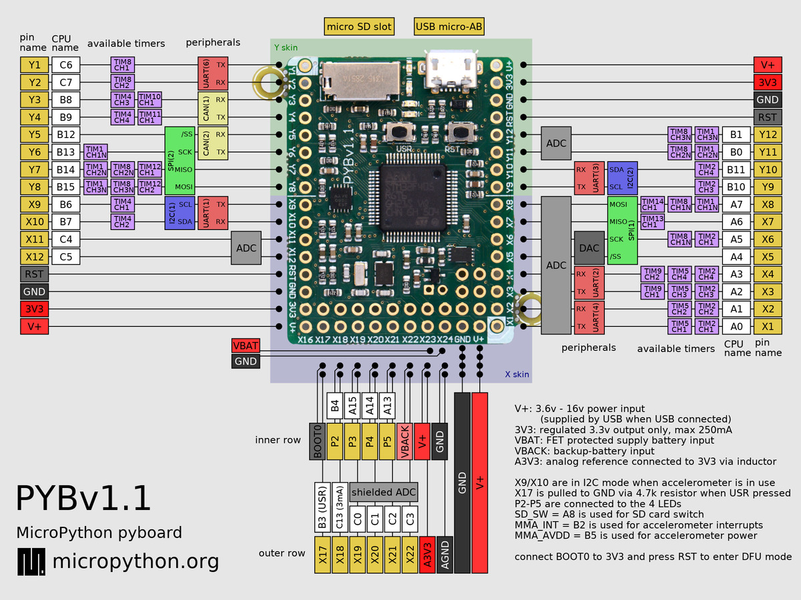

Разводка платы stm32f405vgt6(PyBoard V1.1) [PDF](./PYBv11-schematics.pdf).

Заметки по схеме  

Распиновку смотреть пока что только [тут](../Firmware/target/STM32F405PY1v1) в target.h и target.c
inav/Firmware/stm32f405/Firmware/target/STM32F405PY1v1

  
  
